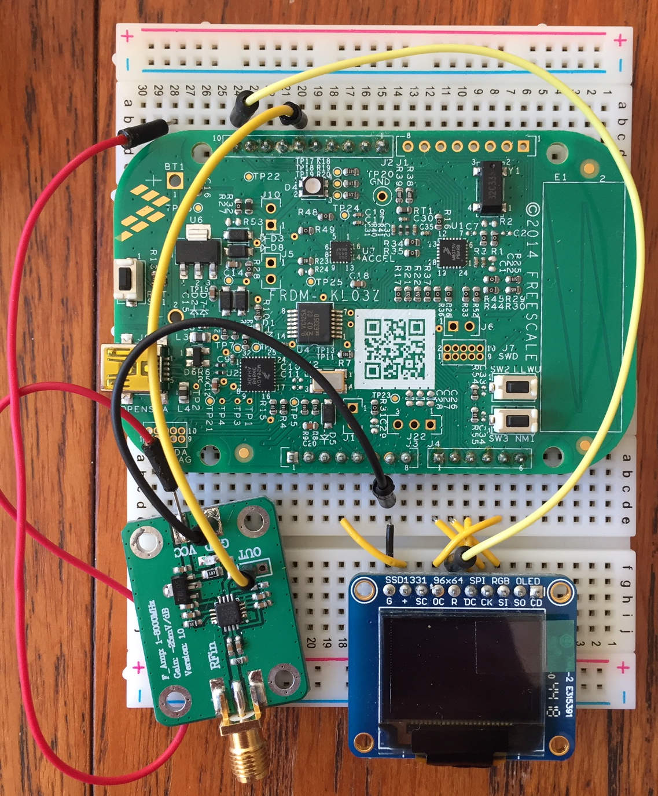

## Overview

This fork belongs to David Swarbrick, `djgs2`, Churchill College, University of Cambridge.


This fork of the Warp Firmware for an FRDM KL03 board implements the use of an AD8318 RF Logarithmic Power Measurement IC connected to GPIO Pin PTB0. Although not added to the Warp menu (due to lacking SPI or I2C interfaces and thus there being few configuration options), the raw ADC reading of PTB0 will be printed when the function `printAllSensors` is called, thus allowing the use of the compiler directive `WARP_BUILD_BOOT_TO_CSVSTREAM` to collect data via a logging interface such as `JLinkLogger`.




This fork also supports a screen implementation based on an SSD1331 connected as follows:
```
MOSI  = PTA8
SCK		= PTA9
OCS		= PTB13
D/C		= PTA12
RST		= PTB3
```
Additionally, if running the device from an external power supply using `VIN` on the FRDM board, such as a 9V battery: connect the screen `VCC (+)` to `3.3V`, and ensure that the screen, sensor and power supply are connected to the same ground location, shown in the picture above as pin 7 on J3.

## Implementation Details
My implementation spans 6 files in `src/boot/ksdk1.1.0/`:
```
devSSD1331.h
devSSD1331_font.h
devSSD1331.c
devAD8318.h
devAD8318.c
warp-kl03-ksdk1.1-boot.c
```
`devSSD1331*` implement functions to write text and numbers (`int` and `float`) to the screen using the font in `..._font.h`. This has been adapted from the [Adafruit GFX Library](https://github.com/adafruit/Adafruit-GFX-Library) (as the [Adafruit SSD1331 Library](https://github.com/adafruit/Adafruit-SSD1331-OLED-Driver-Library-for-Arduino) simply wraps the GFX library). As the code is compiled with a C compiler (rather than C++), I altered it to no longer use Object Orientation, also as this does not conform to the design ethos of similar Warp-implemented sensors. The conversion from `float` to `char` required for printing to the screen was adapted from [this datatype puzzle on GeeksforGeeks](https://www.geeksforgeeks.org/convert-floating-point-number-string/).

`devAD8318.*` provide functions to instantiate the ADC on PTB0, print a reading (for use with `printAllSensors`), and a continuous function to print a calibrated power reading to the screen. My instantiation of the `adc_16` driver is taken from an example in the KSDK API Manual in `doc/'Kinetis SDK v.1.1 API Reference Manual.pdf'`, and my reading function is adapted from the `One Time Trigger` example on page 30. The function which prints a power reading to the screen uses a linear transformation empirically derived from [the 2:29pm dataset stored in this repository](Mon13Jan1429_test_865.9MHz.log) , analysed using [a Python script](measurement-analysis.py) (the other log stored here was not analysed due to time constraints).

These files have all been added to `CMakeLists.txt` in the same directory and to `build/ksdk1.1/build.sh` for full compilation.
